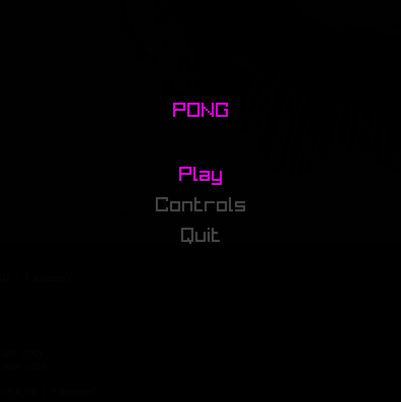
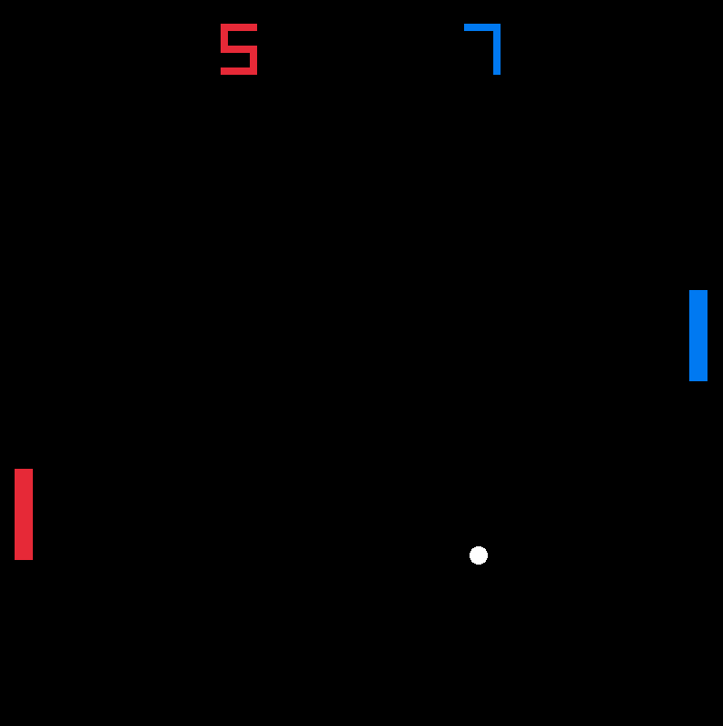
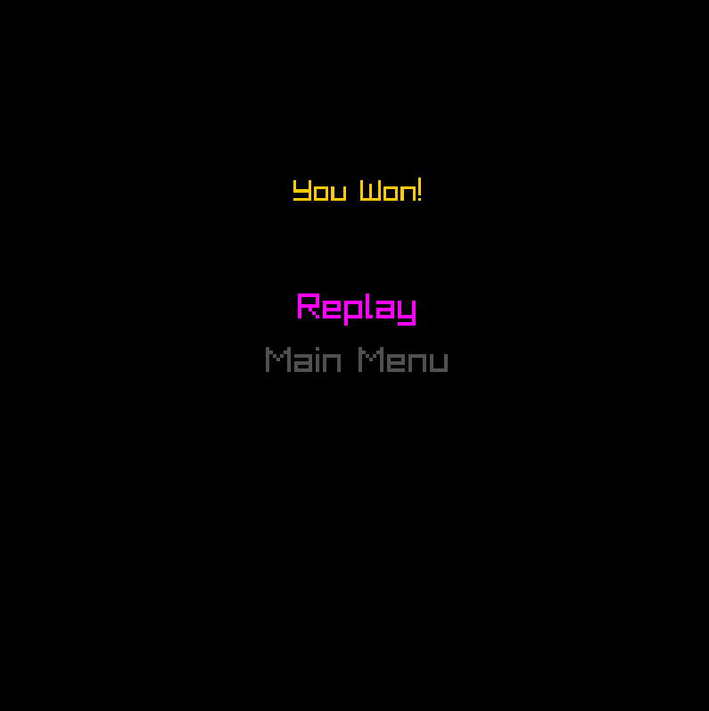

# ECS 
An ECS library implementation written with C++20.

<div style="text-align:center">
  
</div>

<div style="text-align:center">
  
</div>

<div style="text-align:center">
  
</div>

This library is an implementation of the ECS architecture pattern, _with a twist_. It has five main pillars.
1. Entities: collections of components
2. Components: Carry data 
3. Systems: Manipulate data
4. Resources: Allow passing arbitrary data between systems in one level, or even between different levels.
5. Levels: Containers for entities, components, and systems. Each level has its own resources container as well.

For a basic example on how to use the library, check out `examples/basic`. For a more involved application, see `examples/pong`.

# How to build examples
Just go into the example's directory and run the following two commands:
```
cmake -B ./build
cmake --build ./build
```

Then you should find the binary of the example under `./build`

