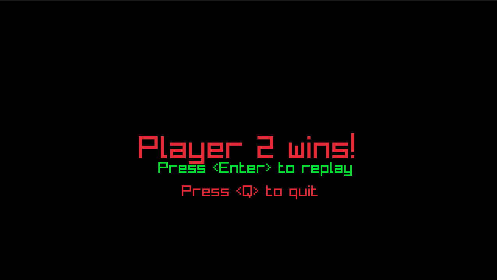

# A pong clone made with raylib(-cpp) with an ECS? system
Started as an attempt to make pong with raylib, turned into something I'm quite proud of. 
Built on my experience with Unity's API. This is just a simple experiment to see how game engines are made, how they are optimized, and how they are architected.

Feel free to use this however you like, or to improve on it/suggest improvements.

# Pong scenes
The scene system allows for different meanings for each input in different scenes. 
It also allows using different entities with different logic without the overhead of updating entities in other scenes.

The current scene system splits the systems and entities of the game with transitions possible between them.

*Main menu*

*Game screen*

*Win screen*

# What's currently implmented?****
- An ECS system. Not really based off any research, just based off my requirements and my experience with the Unity Engine.
- A bit more mature collision system, using a quadtree to optimize collisions. Shapes are still a circle and rect, but that should do for now.
- A "particle" system (It's really just a bunch of calls to raylib to draw a triangle)
- A "Scene" system, does basic condition checking and moving between scenes. Keeps the other scenes in memory.
- A delayed function calling system. Currently allows passing functions and lambdas with a delay.
- I probably forgot something...

# The Big Picture
Here's a quick rundown on how things currently run. I simplified things a bit to focus on the big picture. 
- At the root, you have the entrypoint `RaylibPong.cpp`. Currently it sets up different scenes and the transitions between them, then runs the game.
  - **The game** acts as a container for all scenes and scene independant events.
    - **Scenes** are a container that hold entities created in them and their components. Each scene has a queue for events that can be used for invoking some functions after a delay. You can think of a scene as a **level**.
      - **Each system** holds a list of components and does some operation on each component in a specific way. (perhaps just a linear for loop, a collision quadtree build, etc..).
        - **Components** are the basic block of logic / behaviour in the game. Just inherit from this class and override your needed functions.
      - **Each entity** is a container for components, it also helps broadcast collision events to other components on the same entity.
      - **The event queue** is just a bunch of `Event` objects that we check on every iteration and call the function only when its time is up.